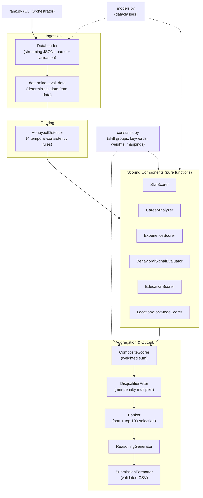
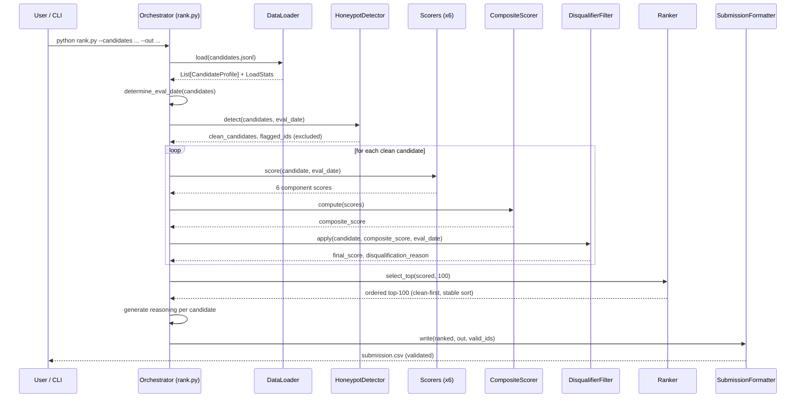

# Shortlist — Intelligent Candidate Ranking System

A deterministic, CPU-only Python pipeline that ranks the top 100 candidates from a
100,000-profile pool for the **"Senior AI Engineer — Founding Team"** role in the
Redrob Hackathon (Intelligent Candidate Discovery & Ranking Challenge).

The system reads `candidates.jsonl`, scores each candidate across six weighted
dimensions, detects and excludes honeypot profiles, applies job-description
disqualifiers, and emits a validated `submission.csv` of the top 100 candidates
with human-readable reasoning.

## Quick Start

```bash
# 1. Create a virtual environment and install dependencies
python -m venv .venv
source .venv/bin/activate
pip install -r requirements.txt

# 2. Produce the submission (the single reproduce command)
python rank.py --candidates ./candidates.jsonl --out ./submission.csv

# 3. Validate the output against the official rules
python validate_submission.py submission.csv

# 4. Run the test suite (unit + property + integration)
python -m pytest -q
```

Constraints satisfied: completes in ~11s on the full 100K dataset (budget 300s),
peaks at ~1.1 GB RAM (budget 14 GB), CPU-only, no network, no hosted LLM calls,
and produces bit-identical output across runs.

## Design Principles

- **Rule-based, not LLM-per-candidate.** An LLM call per candidate cannot fit the
  5-minute / 100K-candidate budget, so the ranker uses transparent heuristic
  scoring over structured features.
- **Deterministic.** The evaluation date is derived once from the dataset's
  latest observed date (not the wall clock), and all sorting uses an explicit
  `(-score, candidate_id)` key. Same input always yields the same output.
- **Reads beyond keywords.** Career-history descriptions, company sizes, and
  behavioral signals are weighed so keyword-stuffers and honeypots are filtered
  out, per the challenge's explicit guidance.
- **Pure, testable components.** Each scorer is a side-effect-free function,
  validated by property-based tests (Hypothesis).

## Architecture

The system is organized as a single-pass pipeline of independent, pure-function
components. Each scoring component reads a `CandidateProfile` and returns a
normalized score in `[0.0, 1.0]`; the composite scorer combines them and the
disqualifier applies penalties.



### Module Map

| Module | Responsibility |
|---|---|
| `rank.py` | CLI entry point + pipeline orchestration (`run_pipeline`) |
| `ranking/models.py` | Dataclasses: `CandidateProfile`, `ScoredCandidate`, `RankedCandidate`, etc. |
| `ranking/constants.py` | Skill-group taxonomy, consulting firms, keyword sets, composite weights, education mappings, lookup helpers |
| `ranking/loader.py` | Streaming JSONL parser with validation and graceful error skipping |
| `ranking/honeypot.py` | `HoneypotDetector` — flags temporally-impossible profiles |
| `ranking/scorers/skill.py` | Skill relevance vs. must-have / nice-to-have groups |
| `ranking/scorers/career.py` | Production-experience inference, consulting/job-hopping penalties, title relevance |
| `ranking/scorers/experience.py` | Years-of-experience fit (5–9 yr target) with career-history validation |
| `ranking/scorers/behavioral.py` | Redrob engagement signals (response rate, GitHub, recency) |
| `ranking/scorers/education.py` | Institution tier, degree level, field relevance |
| `ranking/scorers/location.py` | India / Pune-Noida location fit + work-mode fit |
| `ranking/composite.py` | Weighted combination of component scores |
| `ranking/disqualifier.py` | Applies the most-severe JD disqualification penalty |
| `ranking/ranker.py` | Deterministic sort + clean-first top-100 selection |
| `ranking/reasoning.py` | Per-candidate human-readable explanation |
| `ranking/formatter.py` | Emits the validated submission CSV |

### Composite Score Weights

The final candidate score is a weighted sum of clamped component scores,
multiplied by any disqualifier penalty:

```
final = ( 0.35 * skill
        + 0.25 * career
        + 0.15 * experience
        + 0.10 * behavioral
        + 0.10 * education
        + 0.05 * location_work_mode ) * penalty_multiplier
```

Behavioral signals are intentionally capped at 10% so skills and career history
remain the dominant factors.

## Pipeline Workflow

The pipeline runs as seven sequential stages. Honeypots are excluded before
scoring; disqualified candidates are penalized and only surface if fewer than 100
clean candidates exist.



### Stage Detail

1. **Load & Validate** — Stream `candidates.jsonl` line by line. Malformed JSON
   and records missing required fields are skipped and counted; processing never
   aborts on a bad record.
2. **Derive eval_date** — Compute one evaluation date as the maximum date seen
   across all candidates (signal dates + career dates). This anchors every
   "last N days / months" threshold to the data for reproducibility.
3. **Honeypot Detection** — Flag and exclude profiles with impossible temporal
   data (tenure > company-plausible span, experience/career mismatch, skill
   duration > career span, 10+ expert skills with zero endorsements).
4. **Multi-Dimensional Scoring** — Score each clean candidate across the six
   dimensions.
5. **Composite + Disqualify** — Combine weighted scores, then apply the single
   most-severe disqualifier penalty (recent-AI-only, CV/speech-only,
   no-external-validation, all-consulting).
6. **Rank & Select** — Sort by `(-final_score, candidate_id)` and take the top
   100, preferring non-disqualified candidates.
7. **Reasoning & Format** — Generate a 1–2 sentence explanation per candidate and
   write the validated UTF-8 CSV.

## Data Flow Diagram

How data is transformed as it moves through the system:

```mermaid
flowchart LR
    A[("candidates.jsonl<br/>100,000 raw JSON records")]
    B["List[CandidateProfile]<br/>typed, validated"]
    C["clean candidates<br/>(honeypots removed)"]
    D["component scores<br/>skill, career, experience,<br/>behavioral, education, location"]
    E["ScoredCandidate[]<br/>composite + penalty + final_score"]
    F["ordered top-100<br/>(ranked, with reasoning)"]
    G[("submission.csv<br/>candidate_id, rank, score, reasoning")]

    A -->|"DataLoader<br/>parse + validate"| B
    B -->|"HoneypotDetector<br/>exclude impossible profiles"| C
    C -->|"6 Scorers<br/>per-candidate, normalized [0,1]"| D
    D -->|"CompositeScorer + DisqualifierFilter<br/>weighted sum x penalty"| E
    E -->|"Ranker<br/>stable sort, select 100"| F
    F -->|"SubmissionFormatter<br/>4-decimal scores, UTF-8"| G
```



### Data Transformations

| Stage | Input | Output | Key transformation |
|---|---|---|---|
| Load | Raw JSONL text | `CandidateProfile` objects | Parse, validate required fields, coerce dates/durations |
| Honeypot | All candidates | Clean candidates + flagged set | Drop temporally-impossible profiles |
| Score | `CandidateProfile` | 6 floats in `[0, 1]` | Heuristic scoring per dimension |
| Composite | Component scores | Single composite float | Weighted sum, clamped |
| Disqualify | Composite + profile | `final_score` + reason | Multiply by most-severe penalty |
| Rank | `ScoredCandidate[]` | Ordered top-100 | Stable sort, clean-first selection |
| Format | `RankedCandidate[]` | CSV file | 4-decimal scores, quoted reasoning, UTF-8 |

## Project Structure

```
.
├── rank.py                     # CLI entry point + orchestrator
├── requirements.txt            # hypothesis, pytest, pytest-timeout
├── pytest.ini                  # test markers (integration, slow)
├── conftest.py                 # Hypothesis profile + deterministic seed
├── ranking/
│   ├── models.py               # dataclasses
│   ├── constants.py            # taxonomies, keyword sets, weights, mappings
│   ├── loader.py               # streaming JSONL loader
│   ├── honeypot.py             # honeypot detector
│   ├── composite.py            # composite scorer
│   ├── disqualifier.py         # disqualification filter
│   ├── ranker.py               # ranking + selection
│   ├── reasoning.py            # reasoning generator
│   ├── formatter.py            # submission CSV writer
│   └── scorers/
│       ├── skill.py
│       ├── career.py
│       ├── experience.py
│       ├── behavioral.py
│       ├── education.py
│       └── location.py
└── tests/
    ├── unit/                   # boundary + example tests
    ├── property/               # 22 Hypothesis property tests
    └── integration/            # determinism, no-network, CSV validation,
                                # honeypot rate, performance
```

## Testing

The suite has 129 tests across three layers:

- **Property-based tests (Hypothesis)** — 22 correctness properties covering
  every scoring rule, the composite formula, ranking order, and output integrity.
- **Unit tests** — boundary values (experience fit at 4/5/9/11, honeypot
  thresholds, consulting/CV share boundaries), skill synonym mapping, CSV header.
- **Integration tests** — determinism (byte-identical reruns), no-network
  (socket guard), CSV validation against the official validator, honeypot rate
  (< 10% of top 100), and the full-100K performance benchmark.

```bash
python -m pytest -q                     # everything
python -m pytest tests/property -v      # property tests only
python -m pytest -m "not slow"          # skip full-dataset integration tests
```

## Compute Constraints

| Constraint | Limit | Measured |
|---|---|---|
| Runtime (100K candidates) | ≤ 300 s | ~11 s |
| Peak memory | ≤ 14 GB | ~1.1 GB |
| GPU | none | none |
| Network during ranking | none | none (socket-guarded) |
| Reproducibility | bit-identical | verified |
