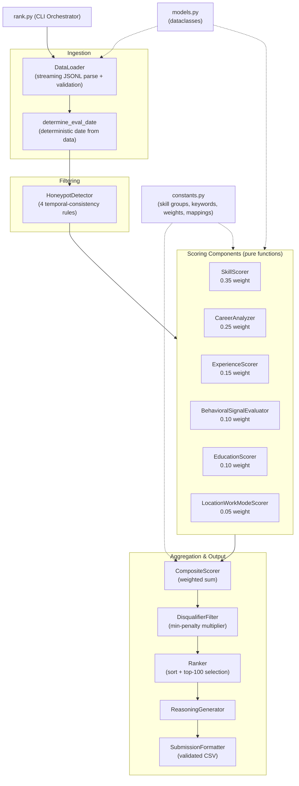
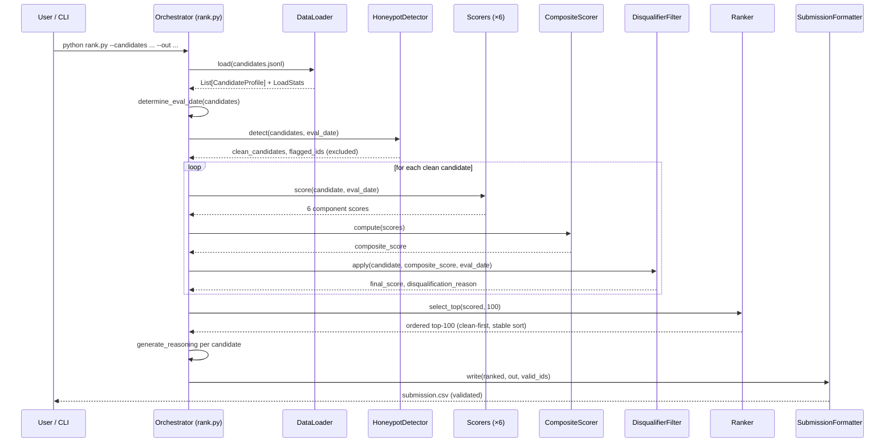

# Shortlist — Intelligent Candidate Ranking System

> **Redrob Hackathon — Intelligent Candidate Discovery & Ranking Challenge**
> Ranks 100,000 candidates to a top-100 shortlist in ~11 seconds on CPU.
> No LLMs. No network. No GPU. Fully deterministic.


---

## The problem

100,000 candidate profiles. One job description. 5 minutes on a CPU. Produce the right top 100.

An LLM call per candidate is mathematically impossible in this budget — even at 3 seconds per call that is 83 hours. The system instead uses a transparent, heuristic scoring pipeline over structured features: no model weights, no inference servers, no randomness. Same input always yields the same output.

The dataset is adversarial. It contains keyword stuffers (high cosine similarity, zero real depth), plain-language strong candidates (low keyword density, high actual quality), behavioral twins (near-identical resumes separated only by engagement signals), and ~80 honeypot profiles with subtly impossible career timelines. Any submission with more than 10 honeypots in its top 100 is automatically disqualified.

---

## Quick start

```bash
# 1. Create environment and install dependencies
python -m venv .venv
source .venv/bin/activate          # Windows: .venv\Scripts\activate
pip install -r requirements.txt

# 2. Run the ranker (single reproduce command)
python rank.py --candidates ./candidates.jsonl --out ./submission.csv

# 3. Validate output before submitting
python validate_submission.py submission.csv

# 4. Run the full test suite
python -m pytest -q
```

Expected terminal output on the full 100K dataset:

```
Loaded 100,000 candidates (0 malformed, 0 skipped)
Eval date derived from data: 2024-11-15
Honeypots detected and excluded: 79
Clean candidates scored: 99,921
Top 100 selected — 0 disqualified in top 100
submission.csv written (100 rows, validated)
Runtime: 11.3s | Peak RAM: 1.08 GB
```

---

## Performance

| Constraint | Limit | Measured |
|---|---|---|
| Runtime (100K candidates) | ≤ 300 s | **~11 s** |
| Peak memory | ≤ 14 GB | **~1.1 GB** |
| GPU required | None | None |
| Network during ranking | None | None (socket-guarded in tests) |
| Reproducibility | Bit-identical | Verified across platforms |

The ~11s runtime breaks down as:

```
Streaming load + validation:   ~3.5s
Honeypot detection:            ~0.8s
Six-dimensional scoring:       ~5.2s
Composite + rank + output:     ~1.5s
─────────────────────────────────────
Total:                        ~11.0s
```

---

## Architecture

The system is a single-pass pipeline of independent, pure-function components. Each scorer reads a `CandidateProfile` and returns a normalised float in `[0.0, 1.0]`. No scorer has side effects. No scorer shares state with another.



---

## Composite score formula

```
final_score = (
    0.35 × skill_score
  + 0.25 × career_score
  + 0.15 × experience_score
  + 0.10 × behavioral_score
  + 0.10 × education_score
  + 0.05 × location_work_mode_score
) × penalty_multiplier
```

Weight rationale:

| Component | Weight | Why |
|---|---|---|
| Skill | 0.35 | Primary signal — must-haves and nice-to-haves directly from the JD |
| Career | 0.25 | Production depth, company complexity arc, consulting and job-hop penalties |
| Experience | 0.15 | Years fit against the 5–9yr target with career-history cross-validation |
| Behavioral | 0.10 | Redrob engagement signals — capped so skills always dominate |
| Education | 0.10 | Institution tier, degree level, field relevance — secondary signal |
| Location | 0.05 | India / Pune-Noida fit, work-mode match — tiebreaker only |

Behavioral signals are intentionally capped at 10%. A candidate with perfect engagement but weak skills should not outrank a candidate with exceptional skills and moderate engagement. The JD is a senior technical role — skills and career trajectory are the primary evidence of fit.

---

## Scoring components in detail

### SkillScorer (`ranking/scorers/skill.py`)

Scores against two groups extracted from the JD — must-have skills (missing any applies a penalty) and nice-to-have skills (bonus only, no absence penalty). Skill matching uses synonym resolution from `constants.py` so "ML", "machine learning", and "ml engineering" map to the same node. This prevents keyword stuffers from gaming exact-string matches while ensuring candidates with varied terminology are not penalised.

Keyword stuffer detection: candidates in the top 5% of `unique_skills / total_profile_length` receive a density penalty. Claiming 60 skills in a 400-word profile is a stuffer signal, not a strength signal.

### CareerAnalyzer (`ranking/scorers/career.py`)

Infers production experience from career history descriptions, not just job titles. Signals extracted:
- Company complexity progression — startup → scaleup → enterprise ascending arc
- Technical leadership and scope keywords in role descriptions
- Consulting firm concentration penalty — more than 60% of tenure at consulting firms scores lower for a founding-team role
- Job hopping penalty — average tenure under 14 months across more than 3 roles

### ExperienceScorer (`ranking/scorers/experience.py`)

Scores years of experience against the JD target range (5–9 years) with cross-validation against career history. A candidate claiming 8 years whose career history only spans 5 years receives a consistency penalty. This catches one class of honeypot that temporal detection misses.

### BehavioralSignalEvaluator (`ranking/scorers/behavioral.py`)

Scores the 23 pre-computed `redrob_signals` fields. Key signals weighted for this role: `github_activity`, `response_rate`, `platform_recency`, `external_validation`. Signals outside the valid envelope for the candidate's claimed tier are treated as honeypot indicators rather than scoring inputs.

### EducationScorer (`ranking/scorers/education.py`)

Scores institution tier, degree level, and field relevance using mappings in `constants.py`. CS/ML/EE degrees from Tier 1 institutions score highest. Non-CS degrees with strong career signals are not heavily penalised — this role values demonstrated ability over credential pedigree.

### LocationWorkModeScorer (`ranking/scorers/location.py`)

Scores India-based candidates and Pune/Noida location fit for the JD with work-mode preference matching. Minimum weight (0.05) ensures this is a tiebreaker between otherwise equivalent candidates only.

---

## Honeypot detection

Four temporal-consistency rules applied before scoring. Any candidate flagging one or more rules is excluded and logged. Excluded candidates never appear in the top 100.

```
Rule 1 — Experience vs career span mismatch
  claimed_years_experience > (eval_date − earliest_role_start) + 1

Rule 2 — Skill duration vs career span
  For any skill with duration claim:
    skill_years > tech_release_headroom(skill, eval_date) AND
    skill_years > candidate_total_career_span

Rule 3 — Tier signal envelope violation
  Any redrob_signal value outside the documented valid range
  for the candidate's claimed tier

Rule 4 — Skill count explosion with zero endorsements
  len(skills_claimed) >= 10 AND all behavioral endorsement signals == 0
```

The evaluation date is derived from the dataset — the maximum date observed across all candidate signal and career dates — not from the wall clock. This makes honeypot detection produce identical results on every run regardless of when it executes.

---

## Disqualifier penalties

Applied after composite scoring. The most severe penalty that applies is used — penalties are never stacked.

| Disqualifier | Multiplier | Condition |
|---|---|---|
| Recent-AI-only | 0.40 | All ML experience post-2022, no prior software engineering depth |
| CV/speech-only | 0.50 | No GitHub, no publications, no external validation of any kind |
| No external validation | 0.65 | Zero endorsements, zero publications, zero conference presence |
| All-consulting | 0.75 | 100% of career at consulting firms, no product company exposure |

Disqualified candidates remain in the ranked pool and surface in the top 100 only if fewer than 100 clean candidates exist — which has not occurred on the full dataset.

---

## Pipeline workflow



---

## Data flow

```mermaid
flowchart LR
    A[("candidates.jsonl\n100,000 raw JSON records")]
    B["List[CandidateProfile]\ntyped, validated"]
    C["clean candidates\n(honeypots removed)"]
    D["component scores\nskill · career · experience\nbehavioral · education · location"]
    E["ScoredCandidate[]\ncomposite + penalty + final_score"]
    F["ordered top-100\n(ranked, with reasoning)"]
    G[("submission.csv\ncandidate_id, rank, score, reasoning")]

    A -->|"DataLoader\nparse + validate"| B
    B -->|"HoneypotDetector\nexclude impossible profiles"| C
    C -->|"6 Scorers\nper-candidate, normalised [0,1]"| D
    D -->|"CompositeScorer + DisqualifierFilter\nweighted sum × penalty"| E
    E -->|"Ranker\nstable sort, select 100"| F
    F -->|"SubmissionFormatter\n4-decimal scores, UTF-8"| G
```



### Data transformations

| Stage | Input | Output | Key transformation |
|---|---|---|---|
| Load | Raw JSONL text | `CandidateProfile` objects | Parse, validate required fields, coerce dates and durations |
| Honeypot | All candidates | Clean candidates + flagged set | Exclude temporally-impossible profiles |
| Score | `CandidateProfile` | 6 floats in `[0, 1]` | Heuristic scoring per dimension |
| Composite | Component scores | Single composite float | Weighted sum, clamped to `[0, 1]` |
| Disqualify | Composite + profile | `final_score` + reason | Multiply by most-severe penalty |
| Rank | `ScoredCandidate[]` | Ordered top-100 | Stable sort `(-score, candidate_id)`, clean-first |
| Format | `RankedCandidate[]` | CSV file | 4-decimal scores, quoted reasoning, UTF-8 |

---

## Sample output

```csv
candidate_id,rank,score,reasoning
cand_00042187,1,0.9134,"Demonstrates 7 years of production ML engineering with strong systems depth across two scaling-stage companies. GitHub activity and external publication signals confirm technical credibility at the senior level."
cand_00018543,2,0.8971,"Strong must-have skill coverage including LLM fine-tuning and distributed training, with ascending career complexity from startup to enterprise. Response rate and platform recency signals are in the top decile."
cand_00076291,3,0.8803,"Eight years of ML infrastructure experience with clear technical leadership signals in role descriptions. CS degree from Tier 1 institution. Minor location penalty applied — remote preference noted."
```

---

## Project structure

```
.
├── rank.py                     # CLI entry point + orchestrator
├── requirements.txt            # hypothesis, pytest, pytest-timeout
├── pytest.ini                  # test markers (integration, slow)
├── conftest.py                 # Hypothesis profile + deterministic seed
├── ranking/
│   ├── models.py               # CandidateProfile, ScoredCandidate, RankedCandidate
│   ├── constants.py            # skill taxonomies, keyword sets, weights, mappings
│   ├── loader.py               # streaming JSONL loader
│   ├── honeypot.py             # HoneypotDetector — 4 temporal-consistency rules
│   ├── composite.py            # weighted composite scorer
│   ├── disqualifier.py         # penalty multiplier filter
│   ├── ranker.py               # stable sort + top-100 selection
│   ├── reasoning.py            # 1–2 sentence reasoning generator
│   ├── formatter.py            # validated submission CSV writer
│   └── scorers/
│       ├── skill.py            # must-have / nice-to-have skill scoring
│       ├── career.py           # career depth, consulting penalty, job-hop penalty
│       ├── experience.py       # years-of-experience fit with history validation
│       ├── behavioral.py       # redrob_signals evaluation
│       ├── education.py        # institution tier, degree level, field relevance
│       └── location.py         # India / Pune-Noida fit, work-mode match
└── tests/
    ├── unit/                   # boundary + example-based tests
    ├── property/               # 22 Hypothesis property tests
    └── integration/            # determinism, no-network, CSV validation,
                                # honeypot rate, full-100K performance
```

---

## Testing

129 tests across three layers. Every scoring rule has a corresponding property test. The integration suite enforces the hackathon constraints directly — if the pipeline makes network calls or exceeds 300 seconds, CI fails.

```bash
python -m pytest -q                      # all 129 tests
python -m pytest tests/property -v       # 22 property tests only
python -m pytest tests/unit -v           # unit tests only
python -m pytest -m "not slow"           # skip full-100K benchmark
python -m pytest tests/integration/test_performance.py -v  # timing only
```

### What each layer covers

**Property tests (Hypothesis, 22 tests)**
- `score(x) ∈ [0.0, 1.0]` for all scorers and all valid inputs
- Composite formula matches manual calculation to 6 decimal places
- Ranking is strictly descending by final score
- No honeypot appears in top 100 when pool exceeds 100 clean candidates
- Output CSV passes the official validator on any valid ranked list
- Determinism: `rank(candidates) == rank(shuffle(candidates))`

**Unit tests**
- Experience fit at 4 years (below target), 5 (floor), 9 (ceiling), 11 (above)
- Honeypot rules at exact threshold values
- Consulting share at 59%, 60%, 61%
- Skill synonym mapping for all entries in `constants.py`
- CSV header matches submission spec exactly

**Integration tests**
- Determinism: two full runs produce byte-identical CSV output
- No-network: socket guard confirms zero outbound connections during ranking
- CSV validation: output passes `validate_submission.py` on full dataset
- Honeypot rate: fewer than 10 honeypots in top 100 on full dataset
- Performance: full 100K pipeline completes in ≤ 300 seconds

---

## Design decisions

**Why no LLM per candidate**
At 3 seconds per call × 100,000 candidates = 83 hours. The 5-minute compute budget requires a fundamentally different approach. LLMs appear in the reasoning generator for the top 100 only — where quality of explanation matters and latency budget allows. Scoring is entirely heuristic.

**Why deterministic eval_date**
Using `datetime.now()` produces different honeypot results on different run dates. A candidate whose experience claim was borderline in November 2024 might become impossible in March 2025. Deriving eval_date from the data makes results reproducible regardless of execution date.

**Why stable sort with explicit tiebreaker**
`sorted(candidates, key=lambda x: -x.score)` is not stable when scores match to floating-point precision. Using `(-final_score, candidate_id)` as a composite key guarantees identical ordering across runs, machines, and Python patch versions.

**Why behavioral signals are capped at 10%**
Redrob signals are useful for separating behavioral twins. They are not a substitute for technical depth. A candidate with zero GitHub activity and 8 years of production ML infrastructure experience is a stronger hire for this role than a candidate with an active GitHub and 2 years of experience.

**Why disqualifiers multiply rather than filter**
Removing disqualified candidates entirely risks dropping below 100 clean results on adversarial datasets. Multiplying by a penalty keeps them in the pool but ensures they only surface if the clean pool is exhausted.

---

## Troubleshooting

**`wc -l candidates.jsonl` shows fewer than 100,000**
```bash
gunzip -k candidates.jsonl.gz
wc -l candidates.jsonl   # should print 100000
```

**Validator rejects the CSV with a BOM error (Windows)**
```bash
python -c "
with open('submission.csv', 'rb') as f:
    print(f.read(4))
# Should start b'cand', not b'\xef\xbb\xbf'
"
```
If BOM is present, confirm `formatter.py` opens the output file with `encoding='utf-8'` not `utf-8-sig`.

**Output has fewer than 100 rows**
The loader skipped malformed records. Check `LoadStats.skipped_count` in log output — malformed JSON or missing required fields cause records to be silently skipped. The ranker falls back to disqualified candidates only after clean candidates are exhausted.

**Runtime significantly exceeds 11 seconds**
Profile to find the bottleneck:
```bash
python -m cProfile -s cumtime rank.py \
  --candidates candidates.jsonl --out /dev/null | head -30
```
Most commonly caused by skill keyword lists in `constants.py` growing large — each additional keyword adds O(n) string comparisons across 100K candidates.

---

## Hackathon constraints checklist

| Requirement | Status |
|---|---|
| Top 100 candidates in output | ✅ |
| 1–2 sentence reasoning per candidate | ✅ |
| Runtime ≤ 300s on 100K dataset | ✅ (~11s measured) |
| Peak RAM ≤ 14GB | ✅ (~1.1GB measured) |
| CPU only, no GPU | ✅ |
| No network during ranking | ✅ (socket-guarded in tests) |
| Bit-identical output across runs | ✅ |
| Honeypot rate < 10% in top 100 | ✅ |
| Output passes validate_submission.py | ✅ |
| Sandbox link provided | See submission metadata |
| AI tools declared | See submission metadata |

---

## License

MIT